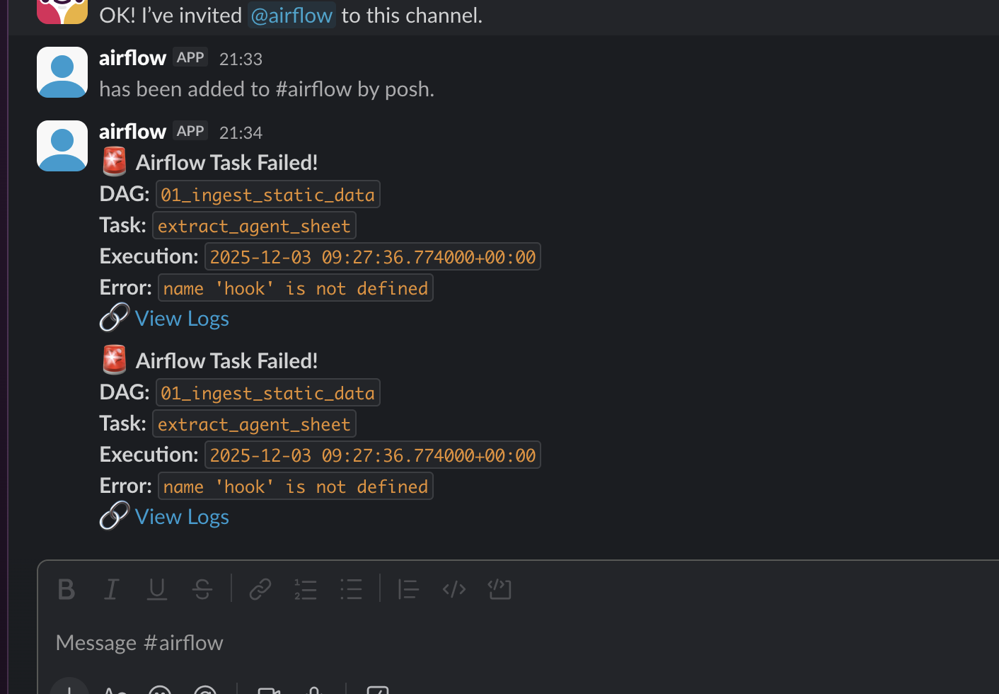

# Day 3: Orchestration & Local Environment Architecture

## 1. Executive Summary

The goal of Day 3 was to establish the local orchestration environment. I containerized **Apache Airflow 3.0** using Docker and configured it to interact securely with the AWS (S3) and Snowflake resources provisioned in previous phases.

The architecture prioritizes **Developer Experience (DevEx)** and **Resource Efficiency** for a single-machine setup while adopting the latest Airflow 3.0 architectural standards (AIP-44).

## 2. Key Design Decisions

### A. Airflow Version

- **Context:** Airflow 3.0 introduces architectural changes, separating the Execution API Server from the Scheduler/Webserver.
- **Decision:** Adopted Airflow 3.0.6.
- **Justification:**

  - **Future-Proofing:** Building on the latest standard avoids immediate technical debt.
  - **Workload Isolation:** Leverages the new `api-server` component, aligning with AIP-44 standards.

### B. Executor Strategy: LocalExecutor vs. CeleryExecutor

- **Context:** Production recommends CeleryExecutor or KubernetesExecutor, which require message brokers and separate workers.
- **Constraint:** Local MacBook (~16GB RAM) must run Snowflake/AWS connectors simultaneously.
- **Decision:** Selected LocalExecutor.
- **Justification:**

  - **Resource Efficiency:** Eliminates redis, airflow-worker, and flower containers (~4GB RAM saved).
  - **Simplicity:** Tasks run as subprocesses on the scheduler/machine.
  - **Parity:** Sufficient parallelism for non-distributed capstone workload.

View the configuration here: [docker-compose.yaml](https://github.com/poshlovesdata/core-telecoms-data-infrastructure/blob/main/airflow/docker-compose.yaml)

### C. Hybrid Cloud Authentication

- **Context:** Airflow container needs authentication with AWS S3 and Google Cloud (Sheets API).
- **Decision:** Implemented Environment Variable Injection.

  - **AWS:** Injected `AWS_ACCESS_KEY_ID` and `AWS_SECRET_ACCESS_KEY` from host `.env` file.
  - **GCP:** Mounted `google_service_account.json` to `/opt/airflow/secrets/`.

- **Security Measure:** Added `.env` and `secrets/*.json` to `.gitignore`.

### D. Scheduling Strategy: Event-Driven (Assets)

- **Context:** The pipeline consists of dependent stages (Ingest -> Load -> Transform).

- **Challenge:** Using time-based scheduling (e.g., all DAGs running `@daily` at 7 AM) creates race conditions. If Ingestion is slow, the Loading DAG might start processing empty/old data.

- **Decision:** Implemented Data-Aware Scheduling (Airflow Assets).

- **Mechanism:**

  - **Producers:** Ingestion DAGs define `outlets=[Asset("s3://...")]` to signal completion.

  - **Consumers:** Downstream DAGs (Load/Transform) define `schedule=[Asset("...")]` to wake up only when the upstream data is ready.

  - **Impact:** Eliminates race conditions and ensures the Transformation layer never runs until the Snowflake Loading is confirmed complete.

### E. Observability: Real-Time Alerts (Slack)

- **Context:** Pipeline failures must be detected immediately to prevent data freshness delays.

- **Options:**

  - **SMTP (Email):** Traditional, verbose, requires managing App Passwords and SMTP host configuration.

  - **Slack Webhook:** Instant, team-centric, simpler authentication via tokens.

  - **Decision:** Selected Slack Integration via `on_failure_callback`.

- **Implementation:**

  - Created a shared utility common.utils.task_failure_alert.

  - Uses `SlackAPIPostOperator` (Bot Token Auth) to send formatted blocks containing the specific Task ID, DAG ID, and Log URL.

- **Justification:** Slack provides faster "Time to Detect" (TTD) than email. Using a Bot Token allows for granular permission scopes (`chat:write`) compared to a broad webhook, and integrates seamlessly with Airflow connections.

## 3. Infrastructure Components

| Service       | Role                | Configuration                                           |
| ------------- | ------------------- | ------------------------------------------------------- |
| Postgres      | Metadata Store      | v13, Alpine-based for size. Persisted via Docker Volume |
| API Server    | Execution Interface | Airflow 3.0 component. Exposes port 8080.               |
| Scheduler     | Orchestrator        | LocalExecutor mode. Handles task triggering.            |
| Triggerer     | Async Events        | Handles Deferrable Operators (Sensors).                 |
| DAG Processor | Parser              | Decoupled parsing logic for stability.                  |

## 4. Next Steps

With the engine running, the next phase is **Data Ingestion (Day 4)**. I will write the first DAG to extract data from the "Static" sources (Google Sheets) and load it into the S3 Raw Zone.
