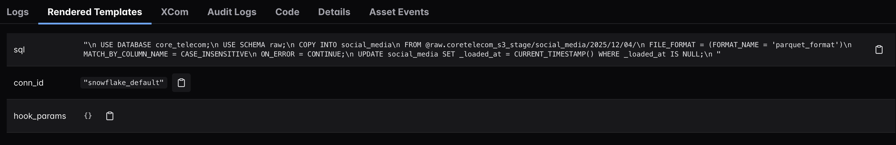

# Day 6: Data Loading Architecture

## 1. Executive Summary

The goal of Day 6 was to implement the **Loading layer (L in ELT)**. I configured the **Snowflake Data Warehouse** to ingest Parquet files from the S3 Data Lake into the **RAW schema tables** using a secure, automated pipeline.

Warehouse configuration script: [snowflake](https://github.com/poshlovesdata/core-telecoms-data-infrastructure/tree/main/scripts/snowflake)

View code: [04_load_raw_snowflake.py](https://github.com/poshlovesdata/core-telecoms-data-infrastructure/blob/main/airflow/dags/04_load_raw_snowflake.py)

## 2. Key Design Decisions

### A. Authentication: Storage Integration (Secure Handshake)

- **Context:** Snowflake needs permission to read files from the private S3 Data Lake bucket.
- **Anti-Pattern:** Hardcoding AWS Access Keys directly in `CREATE STAGE` is insecure.
- **Decision:** Implemented a **Storage Integration** object.
- **Mechanism:**

  - **AWS:** Created IAM Role (`core-telecoms-snowflake-role`) with read access to the Data Lake bucket.
  - **Snowflake:** Created Storage Integration (`cde_s3_int`) pointing to the Role ARN.
  - **Handshake:** Retrieved `STORAGE_AWS_IAM_USER_ARN` and `STORAGE_AWS_EXTERNAL_ID` from Snowflake and updated AWS Role Trust Policy to allow only that specific Snowflake identity.

- **Benefit:** Zero long-lived credentials; authentication handled seamlessly via AWS STS.

View the configuration here: [iam.tf](https://github.com/poshlovesdata/core-telecoms-data-infrastructure/blob/main/terraform/iam.tf)

### B. Loading Strategy: COPY INTO vs. Snowpipe

- **Context:** Daily batch loads are required.
- **Options:**

  - **Snowpipe:** Event-driven, excellent for streaming.
  - **COPY INTO (Batch):** Scheduled SQL loading.

- **Decision:** Selected `COPY INTO` orchestrated by Airflow (`SQLExecuteQueryOperator`).
- **Justification:**

  - **Cost Control:** Snowpipe costs per file; batch loading utilizes warehouse credits efficiently.
  - **Orchestration Dependency:** Ensures transformations run only after successful load, managed via Airflow.

### C. Schema Handling: Explicit Tables vs. Schema-on-Read

- **Context:** Parquet files contain embedded schema metadata.
- **Decision:** Defined explicit DDL for raw tables with `MATCH_BY_COLUMN_NAME = CASE_INSENSITIVE`.
- **Justification:**

  - **Contract:** Guarantees `_ingested_at` exists.
  - **Flexibility:** Column reordering in Parquet files won't break the load.

### D. Idempotency: Partition Pruning

- **Challenge 1:** Preventing duplicate data ingestion if the DAG is re-run for a past date.

  - **Solution:** The loading SQL dynamically targets specific S3 partitions based on the date path.

- **Challenge 2:** Event-driven DAGs (triggered by Assets) do not have a time-based schedule, so Airflow 3.0 removes standard time macros like ds and logical_date from the Jinja context, causing UndefinedError during template rendering.
  

  - **Solution:** Parsed the date directly from the unique run_id string, which always contains the timestamp.

  - **Implementation:** `{{ run_id.split('__')[1][:10].replace('-', '/') }}` converts `asset_triggered\_\_2025-11-20...` into `2025/11/20`.

  - **Impact:** We maintain idempotency and partition pruning even in an event-driven architecture where standard time context is absent.
    
    

## 3. Infrastructure & Configuration

| Component          | Resource Name                | Note                                                        |
| ------------------ | ---------------------------- | ----------------------------------------------------------- |
| AWS Role           | core-telecoms-snowflake-role | Trusts Snowflake's IAM User/External ID.                    |
| Snowflake Stage    | coretelecom_s3_stage         | External stage pointing to `s3://core-telecoms-data-lake/`. |
| Airflow Connection | snowflake_default            | Configured via `AIRFLOW_CONN_SNOWFLAKE_DEFAULT`.            |

## 4. Next Steps

With the data successfully loaded into **Snowflake RAW tables**, the Data Lakehouse is populated. The final phase is **Transformation (Day 7)**. I will use **dbt** to apply business logic, clean the data, and model it into business-ready Marts.
